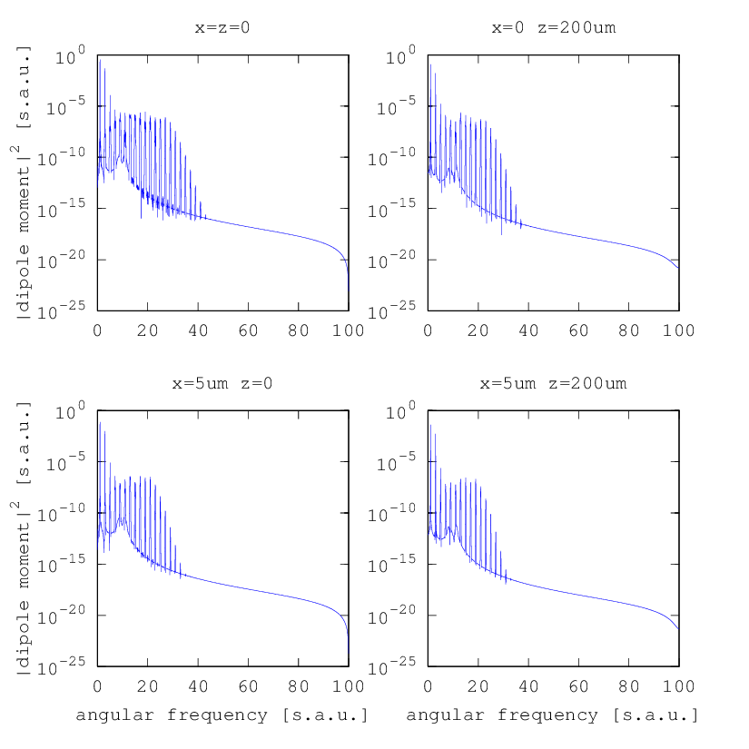

.. _dipole_response:

dipole_response
---------------

Description
~~~~~~~~~~~

The ``dipole_response`` module calculates the Fourier-transformed
dipole response on a given spatial grid, using the Lewenstein model as
implemented in the :ref:`lewenstein` module. Calculating the dipole responses is
what takes most of the time when running the program, therefore an
intelligent on-disk cache is implemented so that already computed dipole
responses can be used later without repeating the calculation. This
module can compute the dipole responses for driving fields with general
time-dependent polarization.

In order to provide maximum flexibility and to avoid the need to keep
big amounts of data in memory, the driving field must either be passed
as a callback function that computes the driving field for a given
position, or as a directory of files containing the position-dependent
precomputed driving field.

Arguments and Return Values
~~~~~~~~~~~~~~~~~~~~~~~~~~~

The signature of the ``dipole_response`` function is

::

    function [omega, response_cmc, progress] = hhgmax.dipole_response(t_cmc, xv, yv, zv, config, progress, return_omega)
        

The return values are:

-  ``omega`` is the angular frequency axis :math:`\omega` corresponding
   to the last index of the ``response_cmc`` return value. It is in
   scaled atomic units, i.e. a value of :math:`1` corresponds to the
   angular frequency of the driving field.

-  ``response_cmc(yi,xi,zi,C,omega_i)`` contains the dipole response for
   each spatial grid point and frequency. It is an array with five
   indices, where the first three give the position in the spatial grid
   (corresponding to the input arguments ``yv``, ``xv`` and ``zv``), the
   last one gives the angular frequency (corresponding to the return
   value ``omega``), and ``C`` numerates the components of the dipole
   moment vector :math:`\vect d = \sum_C d_C \vect e_C`, which is
   important if you do calculations with elliptically polarized fields.

-  ``progress`` (optional) is a ``struct()`` that contains information
   about how much of the calculation is already done and how much time
   was spent. Using this return value only makes sense if you subdivide
   your spatial grid and call the ``dipole_response`` function multiple
   times. The returned ``struct()`` has the following fields:

   -  ``progress.points_total`` is the total number of grid points for
      which the dipole response must be calculated.

   -  ``progress.points_computed`` is the number of grid points for
      which the dipole response was already calculated.

   -  ``progress.time_spent`` is the time in seconds that was already
      spent calculating the dipole responses.

The arguments of the ``dipole_response`` function are:

-  ``t_cmc`` is the vacuum comoving time axis :math:`t'=t-z/c` in scaled
   atomic units, i.e. a value of :math:`2\pi` corresponds to one driving
   field period. It must be equally spaced.

-  ``xv``, ``yv`` and ``zv`` are arrays of :math:`x`, :math:`y` and
   :math:`z` values, respectively, which are used to build the space
   grid on which the dipole responses should to be calculated.

-  ``config`` is a ``struct()`` of the following fields:

   -  ``config.wavelength`` is the central wavelength of the driving
      field, in :math:`\milli\meter`.

   -  ``config.driving_field`` is the name of a function (as string) that calculates the driving field. This callback
      function must have the same signature as :ref:`gh_driving_field`.

   -  ``config.ionization_potential`` is the ionization potential of the
      model atom for which the dipole responses should be calculated, in
      :math:`\text{e}\volt`.

   -  ``config.tau_interval_length`` and ``config.tau_window_length``
      specify the shape of the window function :math:`w(\tau)` used in
      the Lewenstein formula. The former gives the length over which
      integration runs without window function, the latter gives the
      length of an appended :math:`\cos^2` window, i.e.
      ``config.tau_interval_length`` corresponds to :math:`\tau_1` and
      ``config.tau_window_length`` corresponds to
      :math:`\tau_\text{max}-\tau_1`.

      Both arguments are in driving field periods, so to include all
      long trajectories, you should at least choose a
      ``config.tau_interval_length`` of :math:`1`. A reasonable value
      for ``config.tau_window_length`` is :math:`0.5`.

   -  ``config.t_window_length`` is the length of a falling
      :math:`\cos^2` window that is applied to end of the time-dependent
      dipole response before the Fourier transformation is performed to
      obtain the dipole spectrum. This is also used to reduce artifacts
      in the spectrum due to the fact that the array containing the
      time-dependent dipole response starts at zero but may end at a
      non-zero value. This value is also in driving field periods. A few
      periods, e.g. ``config.t_window_length=5``, should be sufficient.

   -  By default, the driving field is assumed to be zero for :math:`t` < ``t_cmc(1)``. To simulate a periodic
      driving field, it is possible to change this behaviour by setting
      ``config.periodic=1`` so that the driving field is periodically
      continued below ``t_cmc(1)``. This only works if the ``t_cmc``
      array is a periodically continuable subdivision of the interval
      :math:`[0,2\pi)`, e.g. ``t_cmc = 0 : pi/100 : 2*pi-pi/100``.
      | For periodic mode, the argument ``config.t_window_length`` must
      be zero and can be omitted.

   -  If the driving field has a spatial symmetry, you can specify this
      symmetry using the ``config.symmetry`` option to save computation
      time. Possible values are ``''`` (no symmetry, default), ``'x'``
      (symmetry w.r.t. :math:`x`-:math:`z`-plane), ``'y'`` (symmetry
      w.r.t. :math:`y`-:math:`z`-plane), ``'xy'`` (symmetry w.r.t.
      :math:`x`-:math:`z`- and :math:`y`-:math:`z`- plane) and ``'rotational'``
      for rotational symmetry.

   -  By default, the full spectrum is kept as calculated, which may consume
      a lot of memory.  The optional
      ``config.omega_ranges`` argument can be used discard a part of the spectrum
      even before saving it to the cache and only keep the interesting ranges.
      The format is
      ``[start1 end1; start2 end2; ...]`` where each pair of ``start``
      and ``end`` values declares one range of angular frequencies
      :math:`\omega`, again in scaled atomic units.

   -  By default, only the dipole spectrum for positive angular
      frequencies :math:`\omega` is returned. If you want to calculate
      the time-dependent dipole response using an inverse Fourier
      transformation, you can set the optional ``config.raw`` argument
      to ``1`` so that you get the raw spectrum as returned by the
      ``fft`` function, with both positive and negative angular
      frequencies. If ``config.raw=1`` is used,
      ``config.omega_ranges`` must not be set.

   -  ``config.cache`` (optional) is a struct that controls the cache. Important values are:

       -  ``config.cache.directory`` -- if set, calculated spectra are saved to disk at the
          specified directory.

       -  ``config.cache.fast_directory`` -- if set, this directory is used for operations that
          need good hard drive performance. You can specify a directory on an SSD or on a local
          hard drive if ``config.cache.directory`` points to a network drive.

       -  ``config.cache.backend`` can be set to ``'NetCDF'`` (default) or ``'fallback'`` which is
          a method to get an on-disk cache for installations of Octave without NetCDF support.

       -  ``config.cache.transpose_RAM`` (default: 1GB) can be used to control the RAM consumption
          of a transpose operation necessary to avoid non-linear disk access. If you use larger
          values, the operation will be faster.

       -  config.components (optional) must be set to the number of electric field vector components
          if you use elliptical polarized driving fields (default: 1)

   -  This module calls the :ref:`lewenstein` module. You can override the
      lower-lewel config values ``epsilon_t`` and
      ``dipole_method``.

   -  Use can pass a static ionization rate :math:`W(|\vect E|)` to account for ground state
      depletion using the optional ``config.static_ionization_rate`` argument. To do so,
      pass a ionization rate vector in SI units.
      Additionally, you have to pass the corresponding electric field axis :math:`E = |\vect E|` in V/m
      using the ``config.static_ionization_rate_field`` argument.

   -  Instead of passing static ionization rates, you can also specify a callback function which computes
      the time-dependent ionization rate :math:`W(t)` from the driving field :math:`\vect E(t)`. For this,
      set ``config.ionization_fraction`` to the name of the callback function (as string).
      This function must have the signature ``Wt = ionization_fraction(t_cmc,Et,config)``.

   -  Additionally, you need to supply all ``config`` fields required by
      the function specified in ``config.driving_field``.

.. -  ``config.precomputed_driving_field`` (optional) can be used to
      specify a directory that contains ``.mat`` files with a
      per-z-slice precomputed driving field to read in. If this option
      is set, ``config.driving_field`` is ignored and can be omitted.
      The directory must be organized as follows:
..    It must contain a file called ``axes.mat`` with the variables
      ``xv``, ``yv``, ``zv`` and ``t_cmc``. If ``xv``, ``yv`` and
      ``t_cmc`` do not match the ones given as arguments to this
      functions, an error is thrown. The file may also contain an
      optional variable ``zv_precision`` which defines the precision in
      :math:`\milli\meter` when looking up the field for a specific
      :math:`z` value in the folder. The default precision is
      :math:`10^{-6}\;\milli\meter`.
..    Furthermore, the directory must contain a file ``data_ZI.mat`` for
      each :math:`z` position given by the ``zv`` variable defined in
      ``axes.mat``, where ``ZI`` is the array index in ``zv``. Each of
      these files must contain an array ``driving_field(XI,YI,C,TI)``,
      where ``XI``, ``YI`` and ``TI`` are indices corresponding to the
      variables ``xv``, ``yv`` and ``t_cmc`` defined in ``axes.mat``,
      respectively, and C is used to specify the electric field
      component in the case of a polarized driving field.
..    For pulses consisting of many oscillations, you get a fairly big
      amount of data per :math:`z` slice, which may be problematic due
      to RAM limitations. Therefore it is also possible to subdivide the
      data files. For this, you can use a more general way of indexing
      the ``driving_field`` variable:
..    Instead of ``driving_field(XI,YI,C,TI)``, you can use
      ``driving_field(DI,C,TI)``, which is treated equally due to an
      internal reshape operation. The index ``DI = (XI-1)+(YI-1)*length(xv)-1``
      is a flattened version of the indices ``(XI,YI)``. Using this
      indexing, you can arbitrarily subdivide the files along the ``DI``
      index, i.e. instead of one big file ``data_1.mat`` containing the
      array ``driving_field(1:10,1:10,1,1:100)``, you can use the
      alternative form of indexing ``driving_field(1:100,1,1:100)`` and
      for example subdivide into two files ``data_1.1.mat`` and
      ``data_1.2.mat``, containing ``driving_field(1:30,1:100)`` and
      ``driving_field(31:100,1:100)``, respectively. The naming scheme
      for subdivided files is ``data_ZI.K.mat``, where ``ZI`` gives the
      :math:`z` position as an index of ``zv`` and ``K`` is a
      consecutive numbering starting at :math:`1`.

-  ``progress`` (optional) is a ``struct()`` that contains information
   about how much of the calculation is already done and how much time
   was spent. Passing this as an argument only makes sense if you
   subdivide your spatial grid and call the ``dipole_response`` function
   multiple times. The passed ``struct()`` must have at least the field
   ``progress.points_total`` and it may have the other fields described
   before (see list of return values).

-  By default, the full spectrum for :math:`\omega\geq0` is returned.
   You can select a spectral range to which the output should be confined using
   the optional ``return_omega`` argument. If specified, it can be a two-valued
   array ``[start_omega end_omega]`` giving the lower and upper bound of the spectral
   range, or an index ``omega_i`` corresponding to the :math:`\omega` axis returned
   as first return value.

Example
~~~~~~~

We consider a :math:`100\;\femto\second` Gaussian pulse that propagates
as a Gaussian beam with a beam waist of :math:`10\;\micro\meter`, with a
peak intensity of :math:`7\;\watt/cm^2` and a central wavelength of
:math:`1\;\micro\meter`. We assume a xenon gas target and compute the
dipole spectrum in four different points: on-axis in the focus and
:math:`200\;\micro\meter` behind the focus, and the same off-axis at a
distance of :math:`5\;\micro\meter` from the optical axis.

.. literalinclude:: ../../../examples/reference/example_dipole_response.m
   :language: matlab

Output
~~~~~~

   Dipole spectra calculated with the ``dipole_response`` module
