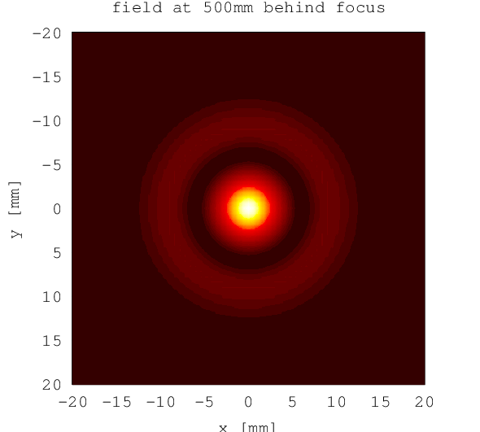

.. _farfield:

farfield
--------

Description
~~~~~~~~~~~

Given the complex electric field amplitude in an input plane, the ``farfield`` module
calculates the field in a far-away plane using the far
field approximation. This is useful to get the electric field of the
harmonics on a screen plane from the electric field right after the gas
target as calculated by :ref:`harmonic_propagation`.

Arguments and Return Values
~~~~~~~~~~~~~~~~~~~~~~~~~~~

The signature of the ``farfield`` function is

::

    function [E_plane] = hhgmax.farfield(xv,yv,z_U,omega, U, config)
        

The return value ``E_plane(omega_i,component,yi,xi)`` is an array that
contains the complex electric field amplitude in the output plane for
each angular frequency. It has four indices, where the first gives the
angular frequency (corresponding to the ``omega`` argument), the second
the electric field component, and the last two give the position within
the output plane (corresponding to the meshgrid input arguments
``config.plane_x``, ``config.plane_y``).

The arguments are:

-  ``xv`` and ``yv`` are arrays of :math:`x` and :math:`y` values for
   the input plane, respectively. The unit is :math:`\milli\meter`.

-  ``z_U`` is the :math:`z` position of the input plane, in
   :math:`\milli\meter`.

-  ``omega`` is the angular frequency axis for the input field given by
   the argument ``U``. It is in scaled atomic units, i.e. a value of
   :math:`1` corresponds to the angular frequency of the driving field.

-  ``U(yi,xi,component,omega_i)`` is the complex electric field
   amplitude in the input plane, and has to be in scaled atomic units,
   and conventional (not comoving) coordinates. It must be an array with
   four indices, where the first two give the position in the input
   plane (corresponding to the ``yv`` and ``xv`` arguments), the third
   gives the electric field component and the last one gives the angular
   frequency (corresponding to the argument ``omega``).

-  ``config`` is a ``struct()`` of the following fields:

   -  ``config.wavelength`` is the central wavelength of the driving
      field, in :math:`\milli\meter`. This is only used for unit
      conversion.

   -  With ``config.plane_x`` and ``config.plane_y`` you specify the
      rectangle within the output plane in which the far field is
      computed. These arguments must be a meshgrid of output plane
      coordinates, in :math:`\milli\meter`. The meshgrid can be produced
      with the ``meshgrid`` function:
      ``[plane_x, plane_y] = meshgrid(plane_xv, plane_yv)`` where
      ``plane_xv`` and ``plane_yv`` are :math:`1`-dimensional arrays of
      :math:`x` and :math:`y` values, respectively.

   -  ``config.plane_distance`` is the distance of the output plane from
      the origin, in :math:`\milli\meter`.

   -  For the far field approximation, a :math:`2`-dimensional spatial
      Fourier transform on the input field is calculated. Then an
      interpolation must be done in this spatial frequency spectrum. Due
      to the oscillating complex phase, this is only possible if the
      resolution of the spectrum is fine enough. If it is not, a warning
      is issued (see ``config.nochecks`` argument). In this case, you
      must increase the resolution of the spectrum by increasing the
      size of the input plane. This can be achieved by applying zero
      padding using the two optional arguments ``config.padding_x`` and
      ``config.padding_y``. The format of both arguments is
      ``[start, end]``, where ``start`` and ``end`` specify the interval
      to which the ``xv`` and ``yv`` arguments should be extended by
      zero padding.

   -  ``config.plane_theta``, ``config.plane_phi`` and
      ``config.plane_psi`` can be used to rotate the output plane around
      the :math:`x`, :math:`y` and :math:`z` axis, respectively, with
      the specified angles. If more than one argument is given, first
      the rotation around the :math:`z` axis is applied, then around the
      :math:`y` axis and then around the :math:`x` axis. If no rotation
      is given, the output plane is parallel to the
      :math:`x`-:math:`y`-plane. All three angles are in degree.

   -  By default, it is checked whether the zero padding applied with
      the ``config.padding_x`` and ``config.padding_y`` arguments is
      sufficient by comparing the phases of adjacent points in the
      spatial frequency spectrum of the input field. If it is not, a
      warning is issued. As this check is computationally quite
      expensive, you can disable the checks by setting the optional
      argument ``config.nochecks=1``.

Example
~~~~~~~

The harmonic radiation ``U`` right after the gas target is computed as
shown in the example of the :ref:`harmonic_propagation` module. Using
this and the corresponding variables ``z_max``, ``omega``, ``xv`` and
``yv``, we can compute the complex electric field of the harmonic
radiation on a screen that is placed :math:`50\;\centi\meter` behind the
focus, standing perpendicular to the optical axis.

.. literalinclude:: ../../../examples/reference/example_farfield.m
   :language: matlab

Output
~~~~~~

   Electric field of harmonic at a :math:`z` plane :math:`50\centi\meter` behind the focus, as computed by the ``farfield`` module
