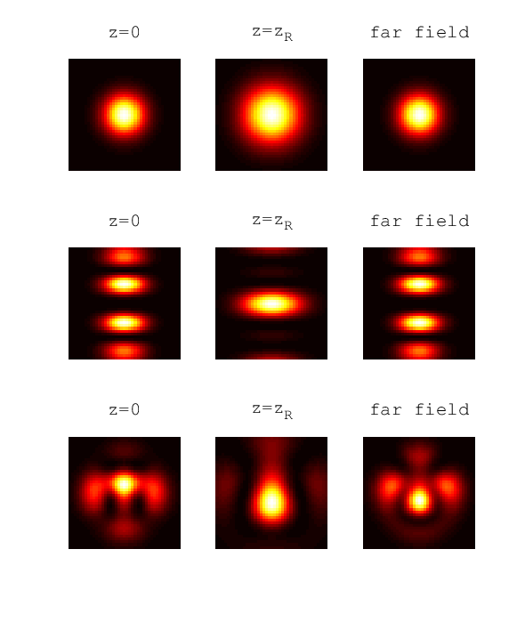

.. _gh_mode:

gh_mode
-------

Description
~~~~~~~~~~~

The ``gh_mode`` module is used by :ref:`gh_driving_field` for
calculating superpositions of Gauss-Hermite modes. You can select some
common modes by name, but also specify the coefficients :math:`A_{nm}`
for the superposition directly to have more control. The following
formula is implemented:

.. math::

   \begin{split}
   \sum_{nm} A_{nm} \cdot \frac{w_0}{w(z)}\cdot
       H_n\left(\sqrt2 \frac{x}{w(z)}\right) \exp\left( -\frac{x^2}{w^2(z)} \right) \cdot
       H_m\left(\sqrt2 \frac{y}{w(z)}\right) \exp\left( -\frac{y^2}{w^2(z)} \right) \times \\
           \exp\left(i\left(kz-(1+n+m)\arctan\frac{z}{z_R} + \frac{k(x^2+y^2)}{2R(z)} \right)\right)
      \end{split}

Arguments and Return Values
~~~~~~~~~~~~~~~~~~~~~~~~~~~

The signature of the ``gh_mode`` function is

::

    function field = hhgmax.gh_mode(x,y,z,k,config)
       

The return value is the complex field amplitude of the mode
superposition at the specified position, for the given k value, or a
grid of values if a grid is used in the arguments.

-  ``x``, ``y`` and ``z`` specify a position in :math:`\milli\meter`
   where the mode should be calculated.

-  ``k`` is the wave number in :math:`\milli\meter^{-1}`. Note that you
   can also pass a grid of values over any subset of the arguments
   ``x``, ``y``, ``z``, and ``k``. In this case, the return value
   ``field`` is also a grid of equal shape.

-  ``config`` is a ``struct()`` of the following fields:

   -  ``config.beam_waist`` is the beam waist :math:`w_0` in
      :math:`\milli\meter`.

   -  ``config.mode_coefficients`` is an array of the coefficients
      :math:`A_{nm}`. The corresponding :math:`n` and :math:`m` values
      must be passed using the ``config.mode_n`` and ``config.mode_m``
      arguments, which must be arrays of the same length.

   -  ``config.mode`` (optional) can be used to select a predefined
      mode. If this is used, the arguments
      ``config.mode_coefficients``,\ ``config.mode_n`` and
      ``config.mode_m`` are ignored and can be neglected. These modes
      are currently implemented:

      -  ``config.mode='TEM00'`` is a simple Gaussian beam.

      -  ``config.mode='GH10'`` is the first higher-order mode
         :math:`GH_{10}`.

      -  ``config.mode='Donut'`` is the mode
         :math:`\sqrt{1/2}\cdot GH_{01} + \sqrt{1/2}\cdot  GH_{10}`.

      -  ``config.mode='1d-quasi-imaging'`` is the mode
         :math:`\sqrt{3/11}\cdot GH_{00} - \sqrt{8/11}\cdot  GH_{04}`.

      -  ``config.mode='2d-quasi-imaging'`` is the mode
         :math:`\sqrt{3/11}\cdot  GH_{00} - \sqrt{4/11}\cdot  GH_{04} - \sqrt{4/11}\cdot  GH_{40}`.

      This argument is case-insensitive.

   -  ``config.rotation`` (optional) is a :math:`3\times3` rotation
      matrix that is applied to the mode. This argument can only be used
      if ``size(x)==size(y)==size(z)``, which can be achieved with the
      ``ndgrid`` and ``meshgrid`` functions.

Example
~~~~~~~

We compute the complex amplitude within three :math:`z` planes for three
different modes, assuming a wavelength of :math:`\lambda=1\micro\meter`.
For the modes, we use a simple Gaussian beam (``config.mode='TEM00'``),
a predefined higher-order mode (``config.mode='1d-quasi-imaging'``) and
a user-defined mode
:math:`\sqrt{3/10} GH_{00} - i\sqrt{5/10} GH_{20} + \sqrt{2/10} GH_{03}`.

Each mode is plotted in the focal plane (:math:`z=0`), in a plane which
is one Rayleigh range behind the focus (:math:`z=z_R`) and at a
:math:`z` value far away from the focus (:math:`z=100 z_R`).

.. literalinclude:: ../../../examples/reference/example_gh_mode.m
   :language: matlab

Output
~~~~~~

   Modes calculated by ``gh_mode`` module. The first row shows a Gaussian beam, the second row the predefined mode ``1d-quasi-imaging``, and the third a custom superposition of Gauss-Hermite modes.
