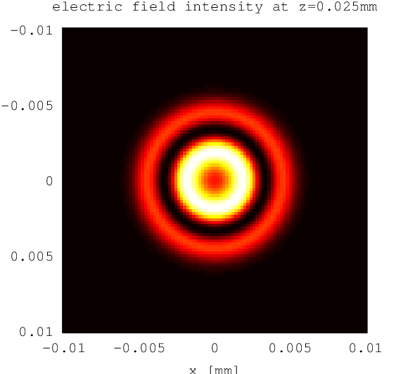

.. _harmonic_propagation:

harmonic_propagation
--------------------

Description
~~~~~~~~~~~

The ``harmonic_propagation`` module simulates the high harmonic
generation on a spatial grid using :ref:`dipole_response` and calculates
the complex electric field amplitude of the harmonic radiation within
the last :math:`z` plane of the grid. The ``dipole_response`` function
is called for each :math:`z` slice of the grid, so that it can be
avoided to keep large amounts of data in memory.

Note that the refractive index is assumed to be one for the harmonic
radiation, so that only geometrical and intensity-dependent phase
matching effects can be accounted for. Absorption of the harmonics
within the gas target can be specified, however. Also note that the
driving fields that have an electric field component parallel to the
optical axis are not supported.

Arguments and Return Values
~~~~~~~~~~~~~~~~~~~~~~~~~~~

The signature of the ``harmonic_propagation`` function is

::

    function [z_max,omega,U] = hhgmax.harmonic_propagation(t_cmc, xv,...
        yv, zv, dipole_response_config, config, return_omega)
        

The return values are:

-  ``z_max`` is the :math:`z` value in :math:`\milli\meter` in which the
   complex electric field ``U`` is computed.

-  ``omega`` is the angular frequency :math:`\omega` axis corresponding
   to the last index of the ``U`` return value. It is in scaled atomic
   units, i.e. a value of :math:`1` corresponds to the angular frequency
   of the driving field.

-  ``U(yi,xi,component,omega_i)`` is the complex electric field
   amplitude of the harmonic radiation within the last :math:`z` plane
   of the input grid, in scaled atomic units. It is an array with four
   indices, where the first two give the position within the output
   plane (corresponding to the input arguments ``yv``, ``xv``), the
   third the electric field component, and the last one gives the
   angular frequency (corresponding to the return value ``omega``).

The arguments are:

-  ``t_cmc`` is the vacuum comoving time axis :math:`t'=t-z/c` in scaled
   atomic units, i.e. a value of :math:`2\pi` corresponds to one driving
   field period. It must be equally spaced.

-  ``xv``, ``yv`` and ``zv`` are arrays of :math:`x`, :math:`y` and
   :math:`z` values, respectively, which are used to build the space
   grid on which the dipole responses are should be calculated.

   As trapezoidal integration in :math:`z` direction is used, you need
   to make sure that the ``zv`` array has at least two elements. For
   testing purposes, it might be convenient to pass an array with only
   one element to save computation time. In this case, a target width of
   :math:`1\;\nano\meter` is assumed and a warning is issued.

-  ``dipole_response_config`` is a ``struct()`` that is passed to the
   ``dipole_response`` function as ``config`` argument. See the
   documentation of the ``dipole_response`` function for more
   information. Note: Until general polarization is implemented, you
   must choose these configuration parameters so that only component of
   the dipole moment vector is returned by ``dipole_response``.

-  ``config`` is a ``struct()`` of the following fields:

   -  ``config.density`` is the density of the gas, in
      :math:`\milli\meter^{-3}`. Currently, the gas density is assumed
      to be constant over the entire spatial grid.

   -  ``config.pressure`` (optional) can be used instead of
      ``config.density`` to provide the gas pressure in :math:`\bbar`.
      Then, the density is calculated using the ideal gas law assuming a
      temperature of :math:`295\;\kelvin`.

   -  ``config.transmission`` and
      ``config.transmission_photon_energy`` (optional) can be used to
      provide a photon-energy-dependent transmission curve of the target
      gas, so that the absorption of harmonics within the gas target can
      be taken into account. If not given, no absorption is assumed.

      ``config.transmission`` must be an array specifying the
      transmission with respect to intensity for the used gas at a
      pressure of :math:`30\;\text{Torr}`, a temperature of
      :math:`295\;\kelvin` and a path of :math:`1\;\centi\meter`.
      ``config.transmission_photon_energy`` is the corresponding photon
      energy axis and must be in :math:`\text{e}\volt`. These data can be
      obtained e.g. from
      http://henke.lbl.gov/optical_constants/gastrn2.html .

   -  By default, it is checked whether the discretization of the space
      grid is fine enough by comparing the phases of the of the harmonic
      radiation at adjacent grid points. If the phase difference is too
      big, a warning is issued. This check is computationally quite
      expensive, so if you are sure that the discretization is fine you
      can disable the checks setting ``config.nochecks=1``.

-  ``return_omega`` (optional) as described in :ref:`dipole_response`.

Example
~~~~~~~

We consider a :math:`1\;\micro\meter` continuous wave Gaussian laser
beam with a beam waist of :math:`10\;\micro\meter` and a peak intensity
of :math:`7\;\watt/cm^2` that hits a xenon gas target with a diameter of
:math:`50\micro\meter`. The electric field right after the gas target is
computed and plotted. Although a continous wave
laser with such a high intensity is not realistic, it makes sense to
approximate a pulsed laser with a long pulse duration by a CW laser, which decreases the computation time drastically.

.. literalinclude:: ../../../examples/reference/example_harmonic_propagation.m
   :language: matlab

Output
~~~~~~

   Electric field of harmonic in plane right after gas target as computed with ``harmonic_propagation`` module
