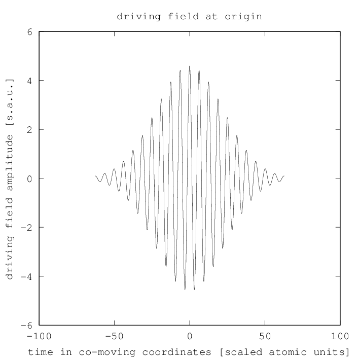

.. _plane_wave_driving_field:

plane_wave_driving_field
------------------------

Description
~~~~~~~~~~~

The module ``plane_wave_driving_field`` calculates the time-dependent driving
field :math:`\vect E(\vect r, t_\text{cmc})` at a given position, in
co-moving coordinates, assuming a plane wave propagating in positive z
direction.
It can be used as a callback function for the
``config.driving_field`` argument of the :ref:`dipole_response` module.

Arguments and Return Values
~~~~~~~~~~~~~~~~~~~~~~~~~~~

The signature of the ``plane_wave_driving_field`` function is

::

    function [Et_cmc] = hhgmax.plane_wave_driving_field(x, y, z, config)
       

The return value is the time-dependent complex electric field as a row
vector (or multiple row vectors if a non-linearly polarized driving
field is used), in vacuum comoving coordinates
:math:`(x',y',z',t')=(x,y,z,t-z/c)` and scaled atomic units. The input
arguments are:

-  ``x``, ``y`` and ``z`` specify a position in :math:`\milli\meter`
   where the time-dependent driving field should be calculated.

-  ``config`` is a ``struct()`` of the following fields:

   -  ``config.wavelength`` is the central wavelength of the driving
      field, in :math:`\milli\meter`. This is only used for unit
      conversion.

   -  ``config.peak_intensity`` is the peak intensity of a corresponding
      Gaussian beam with the same power as the considered spatial mode,
      if both are assumed to be monochromatic. The unit is
      :math:`\watt/\centi\meter^2`.

   -  ``config.pulse_coefficients`` are the complex Fourier coefficients
      of the temporal shape of the pulse, and ``config.omega`` is the
      corresponding angular frequency axis in scaled atomic units. The
      angular frequency axis must include both negative and positive
      frequencies. These two arguments can be produced easily with the
      :ref:`pulse` module.

Example
~~~~~~~

We simulate the electric field of a plane wave in vacuum with a
central wave length of :math:`1\;\micro\meter`. The temporal shape is a
Gaussian pulse with a FWHM of :math:`20\;\femto\second`. For the peak intensity,
we assume :math:`7\cdot10^{13}\;\watt/\centi\meter^2`.

.. literalinclude:: ../../../examples/reference/example_plane_wave_driving_field.m
   :language: matlab

Output
~~~~~~

   Driving field computed by the :ref:`plane_wave_driving_field` module
