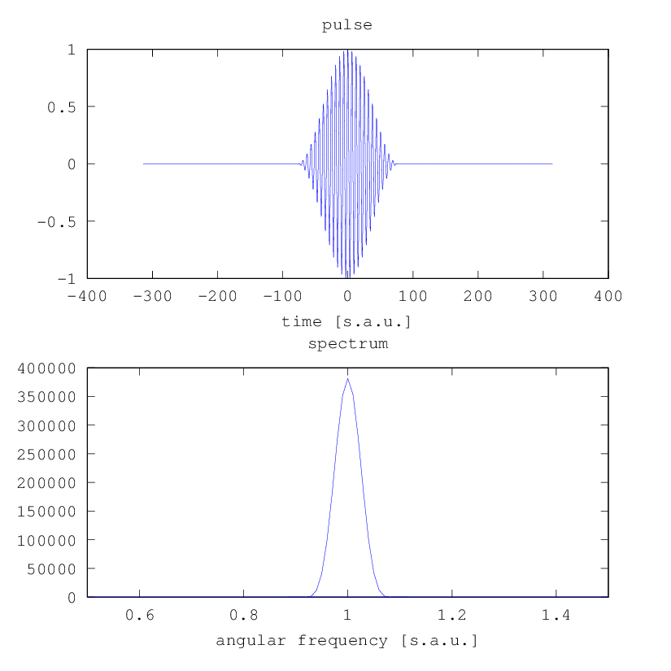

.. _pulse:

pulse
-----

Description
~~~~~~~~~~~

The ``pulse`` module computes the Fourier coefficients of the temporal
shape of the pulse, as needed by :ref:`gh_driving_field`. It can also
produce elliptically polarized pulses.

The signature of the ``pulse`` function is

::

    function [omega, coefficients] = hhgmax.pulse(t, config)
        

The return values are:

-  ``omega`` is the angular frequency axis which is calculated from the
   ``t`` axis supplied as input argument. It is in scaled atomic units,
   i.e. a value of :math:`1` corresponds to the angular frequency of the
   driving field. The array includes negative angular frequencies and
   starts at :math:`\omega=0`.

-  ``coefficients(C,omega_i)`` is an array containing the complex
   Fourier coefficients of the pulse shape, for a peak value of
   :math:`1`. The first index gives the component :math:`C` of the field
   vector, which may take the values :math:`1` or :math:`2` for
   elliptical polarization or just :math:`1` for linear polarization
   (see ``config.ellipticity`` argument), and the second index gives the
   angular frequency corresponding to the return value ``omega``.
   The Fourier transformation is implemented as
   ``conj(fft(conj(...)))`` to account for the sign convention we use,
   which is important to know if you want to invert the Fourier
   transformation to get the temporal pulse shape.

The arguments are:

-  ``t`` is the time axis, as an equally spaced, one-dimensional array.
   It must be in scaled atomic units, i.e. a value of :math:`2\pi`
   corresponds to one driving field period.

-  ``config`` is a ``struct()`` of the following fields:

   -  ``config.wavelength`` is the central wavelength of the driving
      field, in :math:`\milli\meter`. This is only used for unit
      conversion.

   -  ``config.pulse_shape`` (optional) is the temporal shape of the
      pulse. It can be one of ``'constant'`` (continuous wave, default),
      ``'gaussian'`` (a Gaussian pulse), ``'super-gaussian'``
      (:math:`\propto\exp(-\alpha t^4)`) or ``'cos_sqr'`` (a
      :math:`\cos^2` pulse). If this argument is set to a different
      value than ``'constant'``, you also need to supply a
      ``config.pulse_duration`` argument which gives the FWHM of the
      pulse with respect to intensity in :math:`\femto\second`.

   -  By default, the envelope is centered at :math:`t=0` and the
      carrier is a :math:`\cos` function. You can phase shift the
      carrier using the optional ``config.ce_phase`` argument to become
      :math:`\cos(\omega t + \Delta \phi)` were :math:`\Delta\phi` is
      given by ``config.ce_phase`` in radians.

   -  By default, the carrier is a :math:`\cos(\omega_0 t)` function i.e. the output is
      real. You can switch the carrier to :math:`\exp(i \omega_0 t)` to get complex output,
      which is useful e.g. to compute the envelope more easily. For this, use the optional ``config.carrier``
      argument which can take the values ``'cos'`` (default) or ``'exp'``.

   -  By default, a the carrier is assumed to be linearly polarized. In
      this case, the ``C`` index of the return value
      ``coefficients(C,omega_i)`` takes only the value :math:`1`. If you
      specify the optional argument ``config.ellipticity``, an
      elliptically polarized carrier

      .. math:: \frac{1}{\sqrt{1 + (1-e)^2}} \left(\begin{array}{c}\cos(\omega t)\\(1-e)\sin(\omega t)\end{array}\right)

      with given ellipticity :math:`e` is assumed, with two components
      :math:`C=1,2`. This argument can also be combined with the
      ``config.ce_phase`` and ``config.carrier`` arguments.

Example
~~~~~~~

We calculate the spectrum of a :math:`\cos^2` pulse with a FWHM of
:math:`30\;\femto\second` and a central wavelength of
:math:`1\;\micro\meter`. The spectrum as well as the pulse are plotted.

.. literalinclude:: ../../../examples/reference/example_pulse.m
   :language: matlab

Output
~~~~~~

   Time evolution and spectrum of a :math:`\cos^2` pulse computed by the ``pulse`` module
