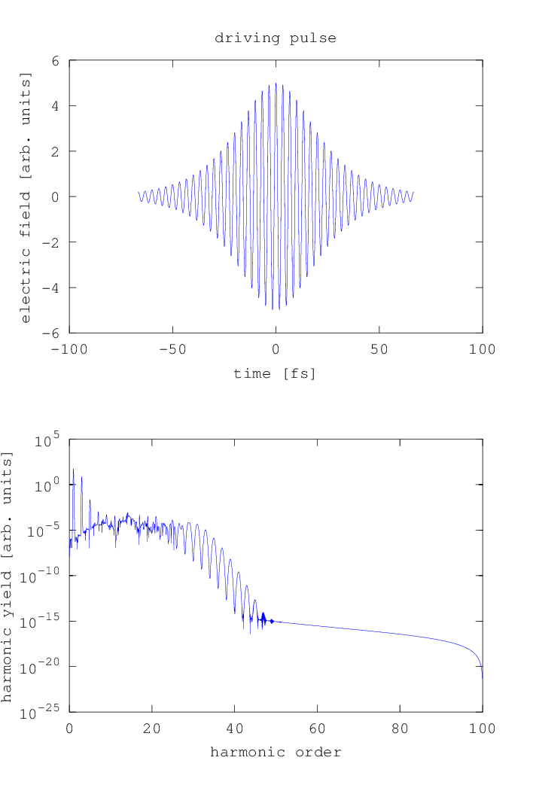

.. _custom_df:

Custom/Pre-Computed Driving Fields
==================================

If the built-in modules :ref:`gh_driving_field` and :ref:`plane_wave_driving_field` do not fit your needs, you have several possibilites:

* You can adapt these modules to your needs, e.g. by adding new pulse shapes to the file ``hhgmax_pulse.m`` which is called by these modules.
* Precompute the driving field and provide the data files as input. For this, consider the reference manual for the :ref:`dipole_response` module.
* Write your own callback module for calculating the driving field.

Example
-------

Here, we only show a simple example for the last one of these possibilites. Let's assume we want a simple driving field callback that computes a plane wave :math:`\mathrm{sech}` pulse. There are a few things you need to take care about.

First, the returned electric field is expected to be in scaled atomic units, which are basically atomic units with the expception that energies are expressed in driving field photon energies and the derived quantites frequency and time are adapted accordingly. You can use the :ref:`sau_convert` module to convert between SI units and scaled atomic units.

Second, you will not get a time axis as input argument. You must pass the time axis as an configuration option yourself to get access to it. This is done to have maximum flexibility, so that you can e.g. also do your calculations in the spectral domain.

Third, the returned electric field is expected to relate to a co-moving time axis :math:`t_\mathrm{cmc} = t - z/c` in order to avoid the necessitity of very large time axes when using pulses.

.. literalinclude:: ../../../examples/tutorial/custom_driving_field/sech_driving_field.m
   :language: matlab

To use this callback, you only need to adapt a few lines from the example of the :ref:`pulses` chapter:

.. literalinclude:: ../../../examples/tutorial/custom_driving_field/sech_dipole_spectrum.m
   :language: matlab
   :emphasize-lines: 19,21-23

Output
------

   Dipole spectrum of single atom with sech pulse as driving field

This example only shows how to adapt the temporal shape of the pulse. You can of course also adapt the spatial shape by using the input arguments ``x``, ``y`` and ``z``. A second example in ``examples/tutorial/custom_driving_field`` shows how to do this by assuming a superposition of two plane waves with slightly different directions.

.. rubric:: Now, you know...

... how to specify arbitrary driving fields.
