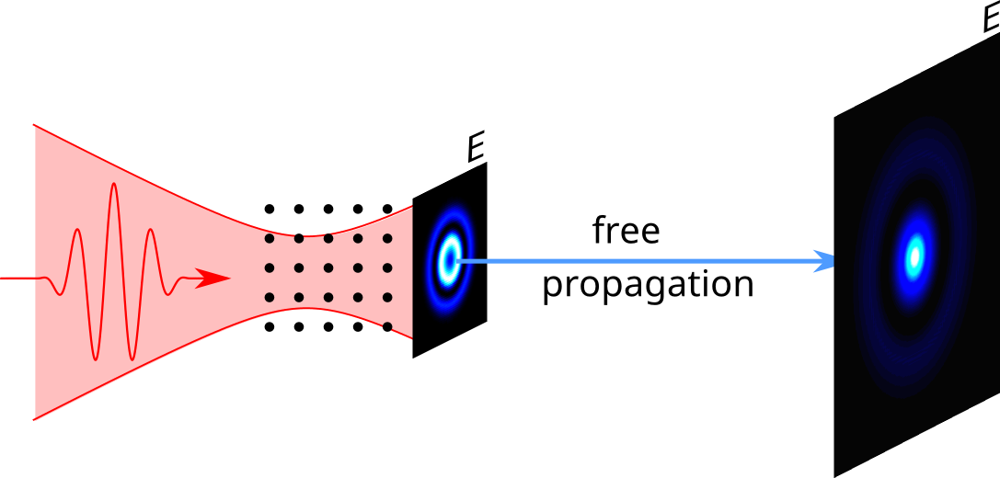
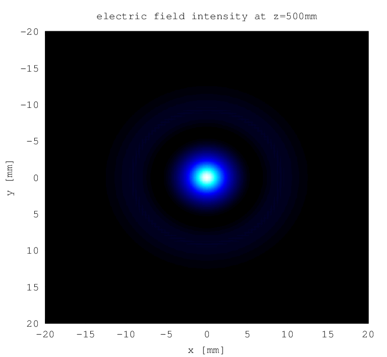

.. _far_field:

Harmonic Far Field
==================

.. highlight:: matlab

You already know how to compute the harmonic electric field right behind the interaction volume. To get the far field, i.e. the harmonic electric field within a far away plane, you can use the :ref:`farfield` module.

For this, first you calculate the near field using the :ref:`harmonic_propagation` module and then apply the :ref:`farfield` module, providing the near field as input.

Example
-------

For computing the far field within a plane, you need to specify the plane position and orientation as well as a discretization of a rectangular section of this plane. Usually, it is also necessary to add zero padding on the input electric field to avoid numerical problems, which is controlled by a configuration option.

Here is an example of how this is done. We calculate the near field just as in the example of the :ref:`propagation` chapter and then add the following code to compute and plot the far field:

.. literalinclude:: ../../../examples/tutorial/farfield/efield.m
   :language: matlab
   :lines: 58-

Output
------

   Electric field intensity in a plane 50cm behind the focus of the driving field

Explanations
------------

You first need to create a configuration ``struct()`` with the driving field wavelength and the following specifications:

**Discretization** of a rectangular section of the output plane:
  The config fields ``plane_x`` and ``plane_y`` must contain a ``meshgrid`` of points at which the harmonic electric field will be evaluated. The used coordinate system are output plane coordinates, which is important if the output plane is rotated. The unit is :math:`\mathrm{mm}`.

Plane **position and orientation**:
  You must specify the distance of the plane from the origin (i.e. the focus position) using ``plane_distance`` configuration field, in :math:`\mathrm{mm}`.
  Keep in mind that the module uses the far field approximation, so you should not choose to small values.
  By default, the plane is perpendicular to the optical axis. You can rotate it around its intersection with the optical axis using the config fields ``plane_theta`` (rotation around :math:`x` axis), ``plane_phi`` (rotation around :math:`y` axis) and ``plane_psi`` (rotation around :math:`z` axis) which must be specified in degree.

**Numerical parameters** for zero padding:
  Internally, the module interpolates within the spatial spectrum of the planar near field. This is only possible if the resolution of the spectrum is high enough so that the phase does not vary to heavily from grid point to grid point. To achieve the necessary resolution, the considered section of the input plane must be large enough. Usually, you try to minimize the size of this section, as it is computationally expensive to calculate dipole responses. The :ref:`farfield` module automatically extends the size of this section using zero padding if you add the config fields ``padding_x`` and ``padding_y``. The format of these config fields is ``[start_value, end_value]``, where ``start_value`` and ``end_value`` must be specified in :math:`\mathrm{mm}`. The module automatically issues a warning if you chose too small values.

After specifying all fields, you need to call the :ref:`farfield` module, passing the near field together with the corresponding axes as well as the created configuration object.

The module will return the complex electric field amplitude within the output plane as an array ``E_plane(omega_i,component,plane_yi,plane_xi)``, where the first index corresponds to the ``omega`` argument, the second gives the electric field component if the field is non-linearly polarized, and the last two correspond to the output plane meshgrid passed as an configuration field.

.. rubric:: Now, you know...

... how to compute the harmonic electric field within a far away plane.
