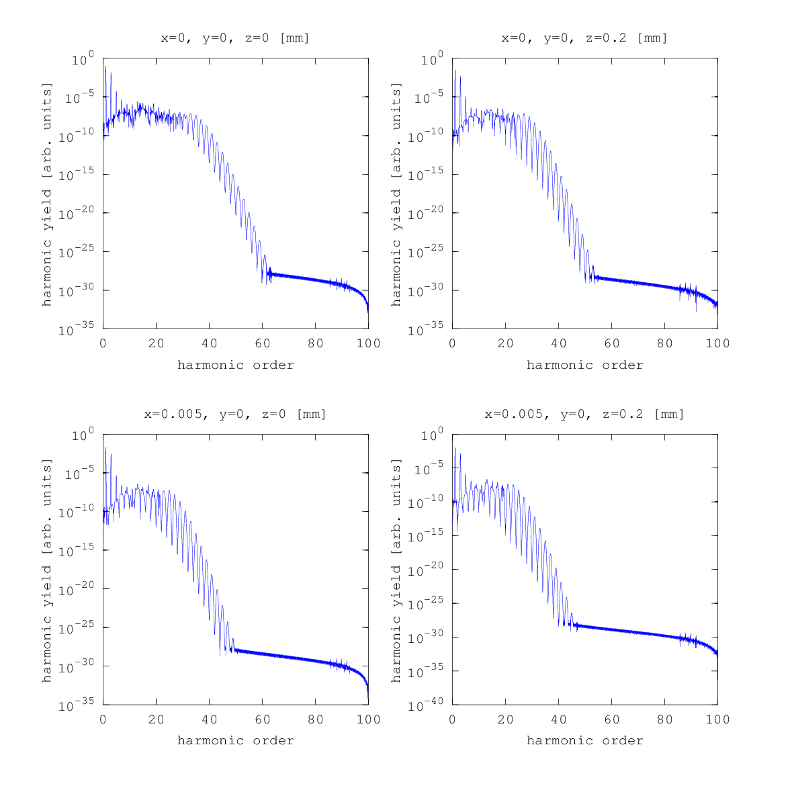

.. _gaussian-beams:

Focussed Beams as Driving Fields
================================

Until now, a plane wave was assumed as a driving field.
In most cases, however, the driving field is a laser beam, which means that the dipole response is spatially dependent.
You can use the :ref:`gh_driving_field` module as callback to compute dipole responses at different positions within a Gaussian beam.

.. highlight:: matlab

For this, you replace the line

::

   config.driving_field = 'plane_wave_driving_field';

by

.. literalinclude:: ../../../examples/tutorial/gaussian_beams/dipole_spectrum.m
   :language: matlab
   :lines: 19-21

Here, ``config.mode`` specifies which mode to use. ``TEM00`` stands for a Gaussian beam; for other possible values consider the reference of the :ref:`gh_driving_field` module.
The option ``config.beam_waist`` is the beam waist, i.e. minimum half diameter of the Gaussian beam and must be given in millimeters. The position of the beam waist is always assumed to be at :math:`z=0`.

Now you can compute and plot the dipole responses at different positions near the focus of the beam:

.. literalinclude:: ../../../examples/tutorial/gaussian_beams/dipole_spectrum.m
   :language: matlab
   :lines: 40-

Output
------

   Single atom dipole spectra at different positions near focus of Gaussian beam

.. rubric:: Now, you know...

... how to compute dipole spectra of atoms placed at different positions near the focus of a Gaussian beam.
