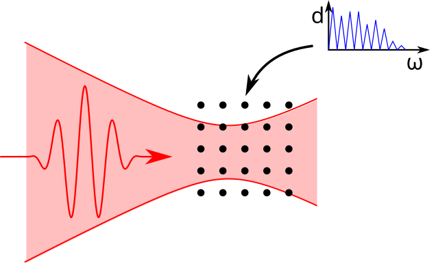
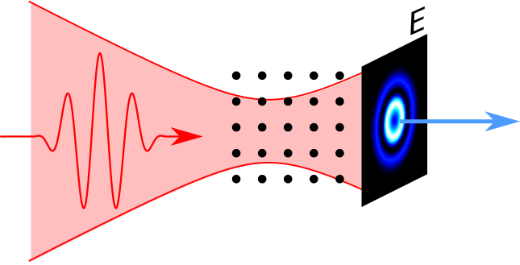
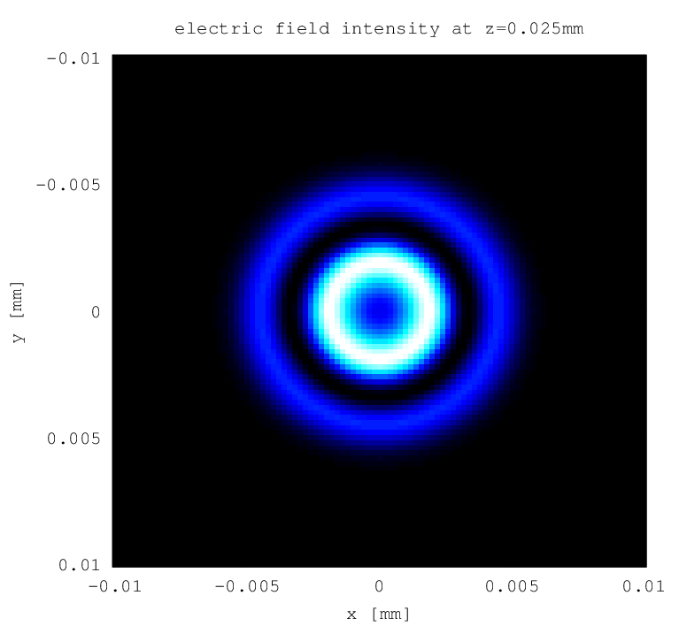

.. _propagation:

Macroscopic Response
====================

You already know how to calculate dipole responses for single atoms of the gas target:

Using the  :ref:`harmonic_propagation` module, you can also calculate the macroscopic dipole response, i.e. the resulting electric field distribution of the harmonics right after the interaction volume:

Let's build on the example from the chapter :ref:`gaussian-beams`. You need two modifications: First, you need to specify a discretization of the interaction volume and second, you need to replace the final call to the :ref:`dipole_response` module by a call to the :ref:`harmonic_propagation` module.
You also need to specify a few more configuration options that will be explained later.

Note that the :ref:`harmonic_propagation` module uses the :ref:`dipole_response` module internally to compute the dipole responses.

Example
-------

This example uses periodic mode as opposed to the example from the chapter :ref:`gaussian-beams` in order to reduce computation time and RAM requirements. To be able to compute with pulses, you may need to apply some of the optimizations described in the chapter :ref:`resources`.

.. literalinclude:: ../../../examples/tutorial/propagation/efield.m
   :language: matlab
   :emphasize-lines: 38-

Output
------

   Electric field intensity in plane right behind interaction volume

Explanations
------------

You need to make the following specifications:

Discretization of the **interaction volume**:
  You have to provide arrays ``xv``, ``yv`` and ``zv`` that define at which points the dipole responses should be calculated. Make sure that the extent in transverse direction (:math:`x,y`) is chosen large enough to cover the region near the optical axis where the driving field intensity is high enough to produce harmonics.
  The extent in :math:`z` direction defines the length of the interaction volume. The discretizations should be fine enough so that the phases of the microscopic dipole spectra do not manifest to large variations from grid point to grid point. If the discretization in any direction is not fine enough, the module will issue a warning.

**Absorptivity** of target gas:
  The :ref:`harmonic_propagation` module can model the absorption of the harmonic radiation by the atoms within the target gas. For this, you need to provide  photon-energy-dependent transmission curve which you can obtain e.g. from http://henke.lbl.gov/optical_constants/gastrn2.html. The transmission must be specified for a path of :math:`1\;\mathrm{cm}` and a pressure of :math:`30\;\mathrm{torr}`, and the photon energy in :math:`\mathrm{eV}`. If omitted, it is assumed that there is no absorption.

**Density** of target gas:
  For the correct scaling of the macroscopic response and for absorption, you must specify the number density of the target gas in :math:`1/\mathrm{mm}^3` using the ``config.density`` option. Alternatively, you can provide a pressure in :math:`\mathrm{bar}` using ``config.pressure`` which will result in the density to be calculated automatically using the ideal gas law assuming a temperature of :math:`295\;\mathrm{K}`. Note: In the current version of the module, the gas density is assumed to be constant over the whole interaction volume.

The :ref:`harmonic_propagation` module will return three values. The first one specifies at which :math:`z` position the electric field is calculated, which is always the largest :math:`z` value of the specified interaction volume. The last one contains the complex electric field amplitude of the harmonic radiation within the output plane. It is an array with four indices ``yi``, ``xi``, ``component`` and ``omega_i``. The first to indices refer to the ``yv`` and ``xv`` arguments, the third index gives the electric field component and the last index refers to the harmonic frequency which is given by the second return value in multiples of the driving field frequency.

.. rubric:: Now, you know...

... how to compute the harmonic electric field right behind the interaction volume.
