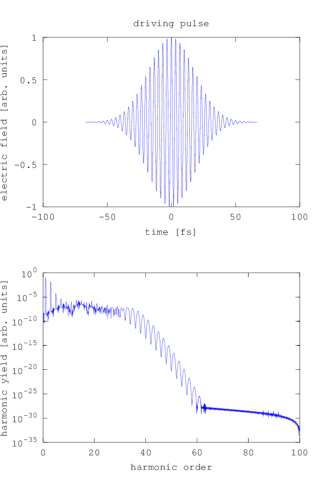

.. _pulses:

Pulsed Driving Fields
=====================

The previous example assumed a cosine driving field.
Although you practically always have pulsed driving fields in experiments, this may be a good approximation
if the pulses are very long compared to the duration of one oscillation, moreover the
computation is very fast.

For more accurate results, you can however also simulate
pulsed driving fields by using the non-periodic mode. For this, you must make some
changes to the :ref:`previous example <single-atom-example>`:

.. highlight:: matlab

- You must set ``config.periodic=0``.
- You must set configuration options that tell the :ref:`pulse` module which pulse
  shape and FWHM to use. Available pulse shapes are ``'gaussian'``, ``'supergaussian'``, ``'cos_sqr'``
  and the default value ``'constant'`` used for cosine driving fields. It is easy to add new pulse shapes
  by editing the file ``hhgmax_pulse.m``.
- You must extend the time axis so that one whole pulse fits in it. The :ref:`pulse` module produces pulses with the peak at
  :math:`t=0`, so the time axis should be centered around :math:`t = 0`.
- As the time-domain dipole response is not periodic anymore, the :ref:`dipole_response`
  module uses a soft window at the end of the time axis before transforming
  to the frequency domain by a Fourier transformation. This is done in order
  to avoid noise-like artifacts in the spectrum. You need to specify the length
  of this window in driving field periods -- a good value are a few periods, but
  make sure that you do not cut important features of the time evolution with
  the window.

Example
-------

Here is an example file where the necessary changes from the previous example
are pointed out.

.. literalinclude:: ../../../examples/tutorial/pulses/dipole_spectrum.m
   :language: matlab
   :emphasize-lines: 11, 14, 23-24, 35, 42-48

Output
------

   Dipole spectrum of single atom with pulsed driving field

.. rubric:: Now, you know...

... how to compute dipole spectra for pulses with a given shape
and full width at half maximum.
