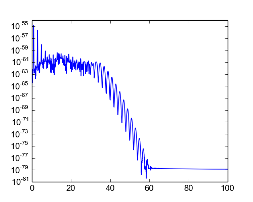

.. _python:

Python module
=============

Although HHGmax is a framework for Matlab/Octave, it additionaly provides a simple low-level Python module :ref:`pylewenstein` that can just compute the single atom dipole response.
If you are using Linux, you have to :ref:`compile <compilation_python>` a shared object file before you can use the module.

For using the python module, only the following files of the framework are relevant::

  pylewenstein.py
  dll64/*
  dll32/*
  lewenstein.cpp
  lewenstein.hpp
  vec.hpp

To use the pylewenstein module, you can just copy these files to your working directory, or add the framework path to Python's search path using ``sys.path.append``.
Also, you need to make sure that you have installed Python’s Numpy extension.

Example
-------

You can compute the single-atom dipole response e.g. for a Gaussian pulse as driving field (compare :ref:`pulses`):

.. literalinclude:: ../../../examples/tutorial/python/dipole_spectrum.py
   :language: python

Note that the ``pylewenstein.lewenstein`` function allows some extra arguments which should be provided for optimal performance in cases where you want to call this function a lot of times. For further reference, see :ref:`pylewenstein`.

.. note:: Until now, there is no periodic mode in the Python module which means that you need special care when you want to compute the response for CW driving fields. You should generally provide more than one period of the driving field as ``Et`` and then discard the part of the dipole response ``d`` before the last driving field period.

Output
------

   Dipole spectrum of single atom with pulsed driving field

.. rubric:: Now, you know...

... how to use the additional Python module to compute single atom dipole responses.
