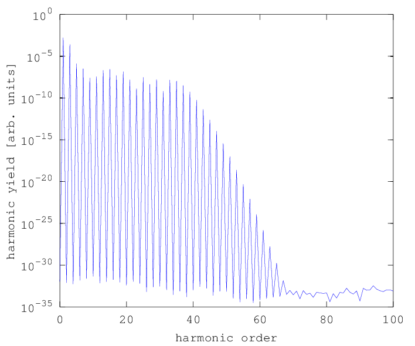

.. _single-atom:

Single-Atom Dipole Response
===========================

The simplest thing that can be done with the framework is to compute the non-linear
dipole response of a single target atom. This is done in the frequency domain, i.e.
you will get the dipole spectrum, but it is also possible to get the time evolution
using a Fourier transformation which will be shown later.

We use the module :ref:`dipole_response`, which can compute the dipole spectra from
a given driving field on a rectangular spatial grid. You need to write a
``.m`` file that contains some obligatory configuration parameters and the call to the :ref:`dipole_response`
module. Here is a simple example, together with the produced plot -- we will walk through the imporant parts of the file.

.. _single-atom-example:

Example
-------

.. literalinclude:: ../../../examples/tutorial/single_atom/dipole_spectrum.m
   :language: matlab

Output
------

   Dipole spectrum of single atom

Explanations
------------

For configuration, you must make the following specifications:

The **time axis**:
  You must provide a time axis which is used for all calculations, and uses comoving coordinates (where a velocity of propagation of :math:`c` is assumed).
  Moreover, the unit are scaled atomic units, i.e. :math:`2\pi` equates to one driving field period.
  If you want to resolve harmonics up to order :math:`n`, you need to have more than :math:`2n` discretization points per driving field period.

Whether **periodicity** of the driving field should be assumed:
  The code for computing the dipole response has two modes of operation: a
  non-periodic mode, which assumes that the driving field is zero outside the
  time range given by the time axis and is more suited for pulsed driving fields,
  and a periodic mode, which extends the driving field periodically and allows
  for singificantly shorter computation times. For periodic mode, the time axis
  must be a periodically continuable discretization of the :math:`[0, 2\pi)`
  interval.

The spatial shape and time evolution of the **driving field**:
  There are two ways of specifying the driving field -- either you can provide
  a callback function or you can provide a directory which contains ``.mat`` files
  with a certain format. The latter method will be covered in chapter :ref:`custom_df`,
  here we restrict ourselves to the callback function. With the framework come
  already two easy-to-use yet configurable callback functions for this purpose,
  :ref:`gh_driving_field` and :ref:`plane_wave_driving_field`, which is used here.
  Both require the temporal pulse shape at the spatial origin to be given (in the frequency domain), where the
  :ref:`pulse` module comes handy.

The parameters of the **model atom** used in the Lewenstein model:
  By default, a model atom with a hydrogen-like potential is assumed which
  only depends of one parameter, the ionization potential.
  Note that you can also provide the dipole matrix elements directly if you want to use a more
  sophisticated atomic model (see :ref:`dipole_response`).

**Numerical parameters** for time integration in the Lewenstein model:
  In the Lewenstein model, the dipole response is represented by an integral over
  the electron excursion time with one infinite endpoint (see description of mathematic model). This integral
  is truncated using a soft window, and you need to specify the
  truncation position and window length.
  To include both the short and long trajectories, values of :math:`1` and :math:`0.5` periods are recommended,
  for only short trajectory you can use :math:`0.66` and :math:`0.05`.

.. todo::
   make better references to mathematical model in the last list item

What follows these specifications is just a call to the :ref:`dipole_response` module,
which computes the dipole spectrum at the desired position.
Note that ``xv``, ``yv`` and ``zv`` may also be arrays, so that you can have the dipole spectrum computed on a
rectangular spatial grid. The second return value of the function is a complex array ``response(yi,xi,zi,C,omega_i)``
with five indices; the first three are for position, the fourth specifies the component
of the electric field and is always :math:`1` for linearly polarized fields, and the last one refers
to the angular frequency which is given by the first return value.

.. rubric:: Now, you know...

... how to compute dipole spectra for different atoms and different
driving field intensities and wavelengths, using a simple (hydrogen-like) atomic model
and assuming a cosine driving field.
